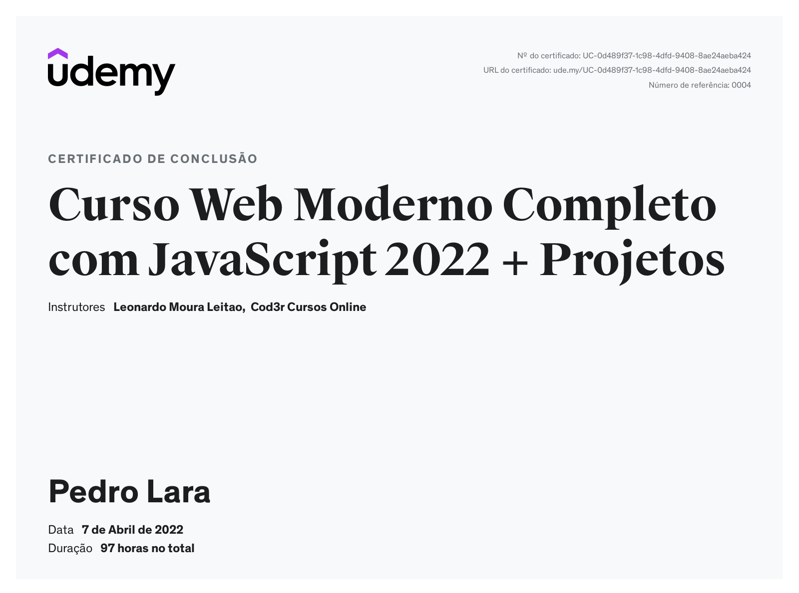

# ⮞ Curso de Desenvolvimento Web Full-Stack
# ⮞ Sobre o curso:
- Foi o primeiro curso que comprei pra iniciar minha vida de "garoto de programa", foi nele que aprendi todos os pilares da programação, desde um console.log('Hello World') até o desenvolvimento de um sistema por completo;
- Infelizmente quando comecei o curso não tinha o hábito de utilizar o Git, então perdi muitos arquivos devido uma falha no meu computador antigo, porém ainda tem muito conteúdo bom e que mostra o meu conhecimento adquirido.
- Como o curso possuia muitas tecnologias diferentes que não eram de meu interesse, eu estudei a stack listada abaixo e não segui o resto do curso, por isso o certificado foi emitido recentemente!!!
# ⮞ Stack na qual foquei:
- JavaScript;
- NodeJs;
- ReactJs;
- MySql;
- HTML;
- CSS;
- Bootstrap;
- Sequelize;
- Express;
- Dentre outras tecnologias...
# ⮞ Destaque do curso:
- [API EXPRESS](https://github.com/PedroLaraa/Curso-Desenvolvimento-Web/tree/main/ApiExpress)
- [EXERCÍCIOS](https://github.com/PedroLaraa/Curso-Desenvolvimento-Web/tree/main/ExerciciosJS)
#
</img>
